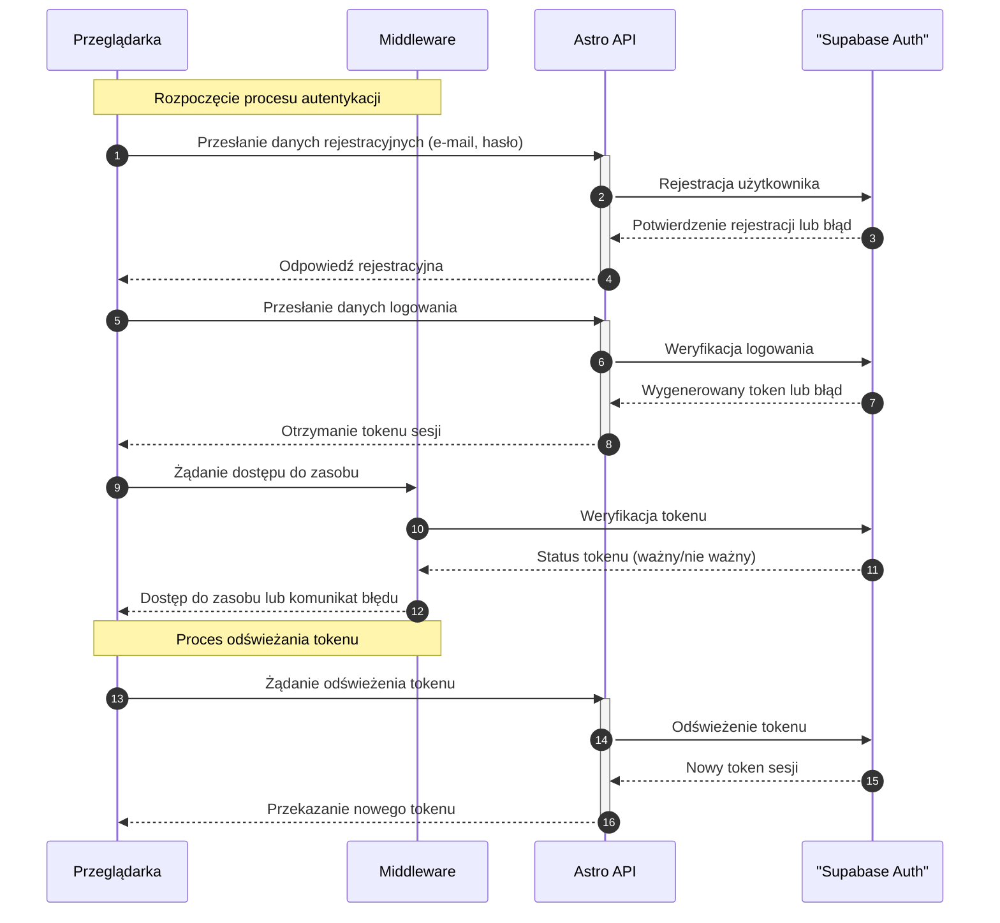

<authentication_analysis>
Analiza modułu autentykacji:
1. Rejestracja: Użytkownik wprowadza e-mail i hasło, a formularz wysyłany jest do Astro API, które przekazuje dane do Supabase Auth w celu rejestracji. Odpowiedź o pomyślnej rejestracji trafia z powrotem do przeglądarki.
2. Logowanie: Użytkownik przesyła dane logowania. Astro API komunikuje się z Supabase Auth, które weryfikuje dane i generuje token sesji. Token jest następnie przesyłany do przeglądarki.
3. Autoryzacja: Każde żądanie dostępu do zasobów przechodzi przez Middleware, który weryfikuje token poprzez Supabase Auth i decyduje o dostępie.
4. Odświeżanie tokenu: Po wygaśnięciu tokenu, przeglądarka wysyła żądanie odświeżenia do Astro API, które inicjuje proces odświeżenia poprzez Supabase Auth.
</authentication_analysis>

<mermaid_diagram>

</mermaid_diagram>