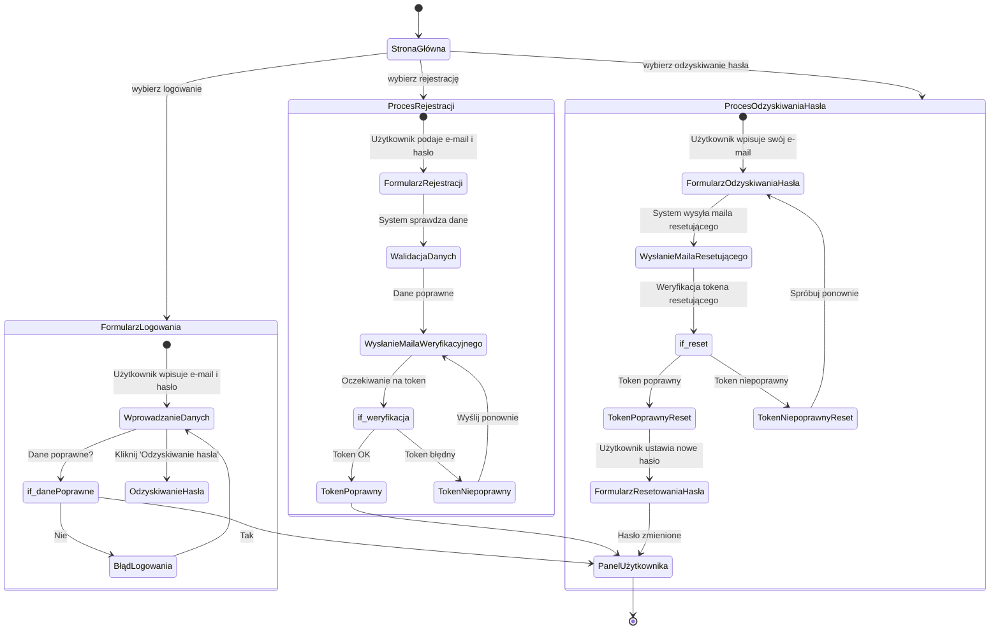

<mermaid_diagram>

```mermaid
stateDiagram-v2
    [*] --> StronaGłówna
    StronaGłówna --> FormularzLogowania: wybierz logowanie
    StronaGłówna --> ProcesRejestracji: wybierz rejestrację
    StronaGłówna --> ProcesOdzyskiwaniaHasła: wybierz odzyskiwanie hasła

    state FormularzLogowania {
       [*] --> WprowadzanieDanych: Użytkownik wpisuje e-mail i hasło
       WprowadzanieDanych --> if_danePoprawne: Dane poprawne?
       if_danePoprawne --> PanelUżytkownika: Tak
       if_danePoprawne --> BłądLogowania: Nie
       BłądLogowania --> WprowadzanieDanych
       WprowadzanieDanych --> OdzyskiwanieHasła: Kliknij 'Odzyskiwanie hasła'
    }

    state ProcesRejestracji {
       [*] --> FormularzRejestracji: Użytkownik podaje e-mail i hasło
       FormularzRejestracji --> WalidacjaDanych: System sprawdza dane
       WalidacjaDanych --> WysłanieMailaWeryfikacyjnego: Dane poprawne
       WysłanieMailaWeryfikacyjnego --> if_weryfikacja: Oczekiwanie na token
       if_weryfikacja --> TokenPoprawny: Token OK
       if_weryfikacja --> TokenNiepoprawny: Token błędny
       TokenPoprawny --> PanelUżytkownika
       TokenNiepoprawny --> WysłanieMailaWeryfikacyjnego: Wyślij ponownie
    }

    state ProcesOdzyskiwaniaHasła {
       [*] --> FormularzOdzyskiwaniaHasła: Użytkownik wpisuje swój e-mail
       FormularzOdzyskiwaniaHasła --> WysłanieMailaResetującego: System wysyła maila resetującego
       WysłanieMailaResetującego --> if_reset: Weryfikacja tokena resetującego
       if_reset --> TokenPoprawnyReset: Token poprawny
       if_reset --> TokenNiepoprawnyReset: Token niepoprawny
       TokenPoprawnyReset --> FormularzResetowaniaHasła: Użytkownik ustawia nowe hasło
       FormularzResetowaniaHasła --> PanelUżytkownika: Hasło zmienione
       TokenNiepoprawnyReset --> FormularzOdzyskiwaniaHasła: Spróbuj ponownie
    }

    PanelUżytkownika --> [*]
```
</mermaid_diagram>