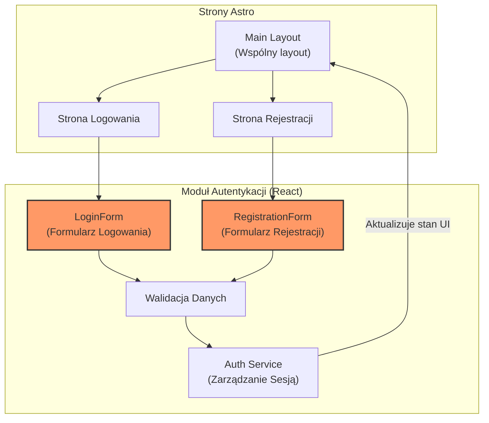

<architecture_analysis>
Analiza modułu logowania i rejestracji na podstawie wymagań z pliku prd.md:
1. Komponenty:
   - LoginForm: Komponent React odpowiedzialny za obsługę formularza logowania, walidację danych oraz komunikację z serwisem autoryzacji.
   - RegistrationForm: Komponent React do obsługi rejestracji, zbierający dane użytkownika (email, hasło) i przekazujący je do serwisu.
   - Walidacja Danych: Proces sprawdzania poprawności wprowadzonych danych w obu formularzach.
   - Auth Service: Moduł zarządzania sesją, który po otrzymaniu danych walidacyjnych, komunikuje się z backendem i aktualizuje stan aplikacji.
   - Main Layout: Komponent Astro współdzielony przez strony logowania i rejestracji, zawiera nagłówek i elementy nawigacyjne.
2. Strony:
   - Strona logowania (Login Page) oraz strona rejestracji (Registration Page) są stronami Astro wykorzystującymi odpowiednie komponenty React.
3. Przepływ danych:
   - Użytkownik wprowadza dane w formularzach, które są następnie walidowane.
   - Po pozytywnej walidacji dane są przesyłane do Auth Service, który aktualizuje stan aplikacji poprzez Main Layout.
4. Opis funkcjonalności:
   - LoginForm: Umożliwia logowanie użytkownika, wywołuje walidację i przekazuje dane do Auth Service.
   - RegistrationForm: Ułatwia rejestrację nowego użytkownika, wysyła dane do Auth Service po walidacji.
   - Walidacja Danych: Zapewnia, że dane wejściowe spełniają wymagane kryteria.
   - Auth Service: Zarządza stanem sesji, potwierdza autentykację i aktualizuje UI.
</architecture_analysis>

<mermaid_diagram>

</mermaid_diagram>